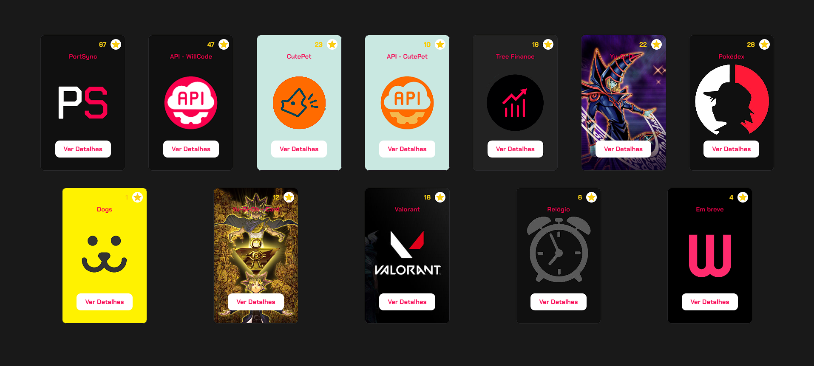
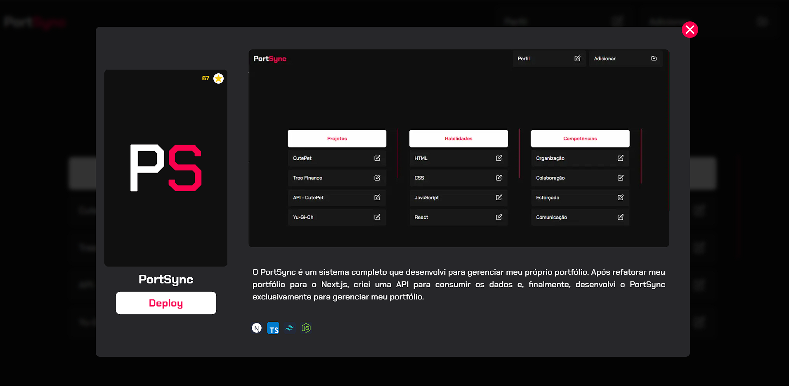

</h1>
   
<h1>Rotas Paralelas</h1> 
<h2>Interceptação de Rotas</h2> 

## Descrição

### Neste projeto, estou implementando a interceptação de rotas e criando [rotas estáticas](https://nextjs.org/docs/app/building-your-application/routing/dynamic-routes) em conjunto com a funcionalidade de [Parallel Routing](https://nextjs.org/docs/app/building-your-application/routing/parallel-routes), o que resulta em uma experiência incrível para os usuários. A vantagem principal é a capacidade de renderizar simultaneamente ou condicionalmente várias páginas no mesmo layout, o que significa que há apenas um carregamento inicial, sem necessidade de carregamentos adicionais ao navegar entre as páginas, pois todas já foram carregadas durante a construção do aplicativo.

### Outro benefício é a possibilidade de renderizar slots de forma condicional, dependendo de certas condições, como o estado de autenticação do usuário. Isso permite manter códigos separados para a mesma URL, tornando a organização e a manutenção do código mais eficientes.

### Com a combinação da interceptação de rotas e o uso inteligente do Parallel Routing, estamos proporcionando aos usuários uma navegação mais fluída, conteúdo mais rápido e maior flexibilidade na apresentação de informações. Essa abordagem é realmente incrível e nos possibilita criar aplicativos web mais avançados, intuitivos e atraentes para que os usuários desfrutem de uma experiência aprimorada.

[Ver Projeto](https://interception-routes.vercel.app/)

#

## Layout web

#

 

## 🛠️ Tecnologias

💻 **Front-end**
- [Next.js 13.4](https://nextjs.org)
- [Typescript](https://www.typescriptlang.org)

📚 **Bibliotecas**
- [zustand](https://zustand-demo.pmnd.rs/)
- [react-query](https://tanstack.com/query/latest/docs/react/overview)
- [react-icons](https://react-icons.github.io/react-icons/)

🎨 **Estilização**
- [tailwindcss](https://tailwindcss.com/docs/installation)

🔋 **Versionamento e Deploy**
- [Git](https://git-scm.com)
- [Vercel](https://vercel.com/)

 

⚙️ **Configuranções e Instalações**

Clone do Projeto

    $ git clone https://github.com/renovatt/interception-routes.git
Instalando as dependências

    $ npm install

Iniciando o projeto

    $ npm run dev

 

**Como contribuir?**

- Você pode dar suporte me seguindo aqui no GitHub
- Dando uma estrela no projeto
- Criar uma conexão comigo no linkedin fazendo parte da minha networking e curtir o meu projeto.

 

**Autor**
[Wildemberg Renovato de Lima](https://www.linkedin.com/in/renovatt/)